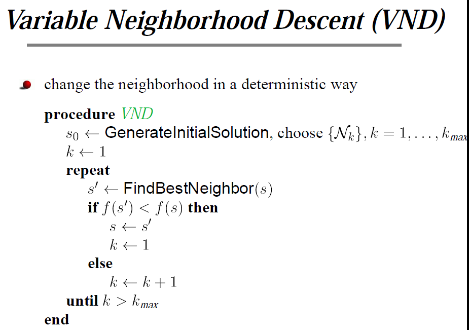
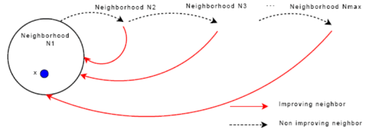
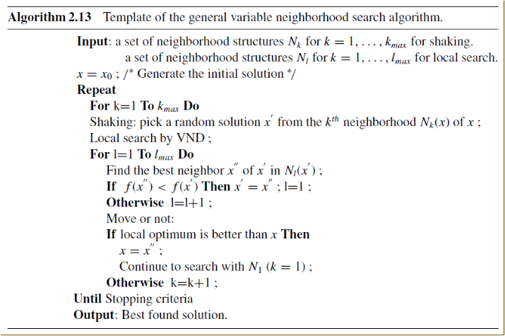

# 变邻域搜索（VNS）算法
## 局部搜索算法
局部搜索算法的一般流程：

- 在算法参数控制下由当前状态的邻域中产生若干个候选解。
- 以某种策略在候选解中确定新的当前解。
- 伴随控制参数的调节，重复执行上述搜索过程，直至满足算法终止条件。
- 结束搜索过程并输出优化结果。

局部搜索的几大要素：
- 目标函数：用来判断解的优劣。
- 邻域的定义：根据不同问题，有着不同的邻域定义。
- 初始解的产生规则
- 新解的产生和接受规则
- 算法终止准则
## 邻域
- 在距离空间中，邻域一般被定义为以给定点为圆心的一个圆；
- 而在组合优化问题中，邻域一般定义为由给定转化规则对给定的问题域上每结点进行转化所得到的问题域上结点的集合

## 邻域动作
经典的邻域动作有：交换操作，插入操作，替换操作。。。
- 交换操作：在一个序列中随机交换任意两个元素的位置
- 插入操作：在一个序列中的任意位置随机插入元素(如果可以的话)
- 替换操作：在一个序列中将任意一个元素替换
- 也可以根据自己所做问题的特征来设计一个更合理的邻域动作

### example 1
对于一个bool型问题，其当前解为：$s = 1001$，当将邻域动作定义为翻转其中一个bit时，得到的邻域结构$N(s)={0001,1101,1011,1000}$，其中$N(s) \subseteq S$。同理，当将邻域动作定义为互换相邻bit时，得到的邻居解的集合$N(s)={0101,1001,1010}$。

注意：$N(s)$表示当前邻域操作下得到的邻域结构，$S$表示该问题的解空间

## VNS的基本思想
VNS的基本思想是，在搜索过程中系统地改变邻域结构集来拓展搜索范围�0�2获得局部最优解�0�2再基于此局部最优解重新系统地改变邻域结构集拓展搜索范围找到另一个局部最优解的过程。

## VNS算法的组成部分：
- (1) 变邻域下降算法（VARIABLE NEIGHBORHOOD DESCENT (VND)）
- (2) 扰动（VARIABLE NEIGHBORHOOD DESCENT (VND)）

### VND

- 当在本邻域搜索找不出一个比当前解更优的解的时候，我们就跳到下一个邻域继续进行搜索。如图中虚黑线所示。
- 当在本邻域搜索找到了一个比当前解更优的解的时候，我们就跳回第一个邻域重新开始搜索。如图中红线所示。

step1:产生初始解s1。
step2:shaking s1，得到解s2。
step3:对解s2进行VND，得到解s3。
step4:如果达到边界条件，结束程序，输出最优解。否则跳回第二步。

