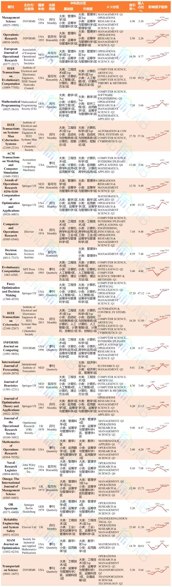

---
# 运筹学领域必看的期刊
## <mark2>国外期刊</mark2>

## <mark2>国内期刊</mark2>

## <mark2>我想投的期刊</mark2>

| 期刊名 	| 涉及的研究方向	| 影响因子 	| 平均审稿速度 	| 出版周期 	| WOS期刊SCI分区 	| 中科院SCI分区(基础版) 	| 中科院SCI分区(升级版) 	|   国人占比	|
|:------:	|:--------:	|----------	|--------------	|----------	|----------------	|-----------------------	|-----------------------	|---	|
|    ANNALS OF OPERATIONS RESEARCH    	|      管理科学-运筹学与管理科学    	|       4.82   	|     6个月         	|    半月刊      	|     OPERATIONS RESEARCH & MANAGEMENT SCIENCE <mark1>Q2</mark1>         	|                       大类学科(管理科学)<mark1>3区</mark1>；小类学科(运筹学与管理科学)	<mark1>3区</mark1>|            大类学科(管理科学)<mark1>3区</mark1>；小类学科(运筹学与管理科学)	<mark1>3区</mark1>          	|   9.49%	|
|      Fuzzy Optimization and Decision Making  	|    工程技术-计算机：人工智能  	|    5.274      	|        >12周      	|      季刊    	|            OPERATIONS RESEARCH & MANAGEMENT SCIENCE <mark1>Q1</mark1>    	|    大类学科(工程技术)<mark1>2区</mark1>；小类学科(运筹学与管理科学)<mark1>2区</mark1>                 	|        大类学科(计算机科学)<mark1>2区</mark1>；小类学科(运筹学与管理科学)<mark1>2区</mark1>            	|   47.12%	|
|       TRANSPORTATION SCIENCE 	|     工程技术-运筹学与管理科学     	|   4.898       	|    12个月          	|        季刊  	|         OPERATIONS RESEARCH & MANAGEMENT SCIENCE<mark1>Q1</mark1>       	|          大类学科(工程技术)<mark1>3区</mark1>；小类学科(运筹学与管理科学,运输科技)<mark1>3区</mark1>         	|         大类学科(工程技术)<mark1>2区</mark1>；小类学科(运筹学与管理科学,运输科技,交通运输)<mark1>3区</mark1>                	|   5.64%	|
